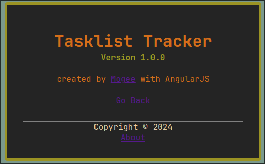
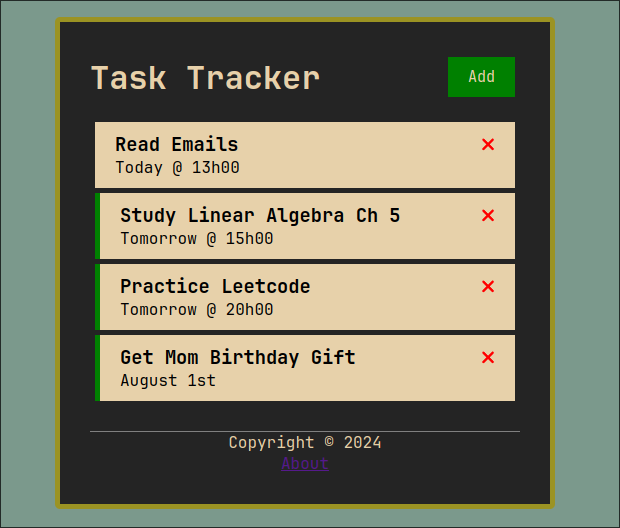
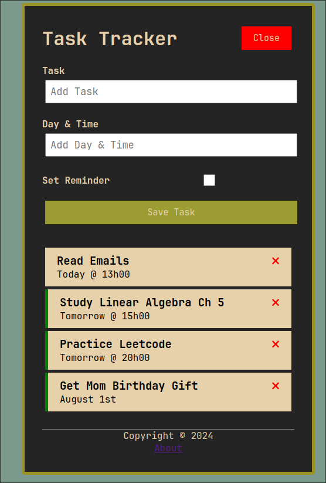

# Task Tracker Project

This project is a task tracker or todo list CRUD application using the AngularJS framework while following this [YouTube Tutorial](https://www.youtube.com/watch?v=3dHNOWTI7H8&t=23s).
I completed this project to familiarize myself with AngularJS and building simple CRUD applications.

This project was generated with [Angular CLI](https://github.com/angular/angular-cli) version 18.0.5.

<div style="display:flex;justify-content: center;margin: 1rem;">
  
</div>
<div style="display: flex; justify-content: space-evenly;">


</div>

## Development server

Run `ng serve` for a dev server. Navigate to `http://localhost:4200/`. Then run the backend server explained in the next section. From
here on you can then explore the Webapp.

## JSON Server Backend

The backend of this project is using json-server to simulate a mock REST API.
PUT, POST, and GET requests are all performed on the db.json file which acts as the backend-server.
To start the server make sure json-server is first installed on your system, it can be done with :

```bash
npm install json-server
```

To run the server, use the following command:

```bash
npm run server
```

An item on the db.json database takes the following form

```json
{
  "id": string,
  "text": "Read Emails",
  "day": "Tuesday the 18th @ 14h00",
  "reminder": true
}
```
